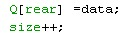
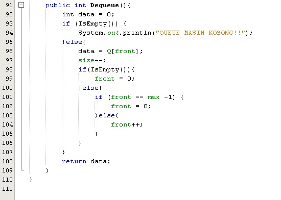
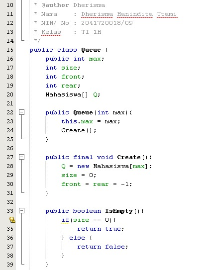

# JOBSHEET VIII (Pertemuan 10)

### Dherisma Hanindita Utami
### 2041720018/ 09/ TI 1H

## 8.2
### 8.2.3 Pertanyaan

Jawaban
1. Dimulai dari 0 karena agar datanya dapat muncul, sedangkan -1 dianggap tidak ada datanya 
2. Rear sama dengan max-1 maka rear akan menjadi 0
3. Program menunjukkan bahwa data baru disimpan pada posisi terakhir di dalam queue pada method enqueue

4. Program menunjukkan data otput

5. Program pada method dequeue yaitu jika pada font sama dengan max dikurangi 1 maka front sama dengan  0, dan akan digunakan untuk menyimpan bagian data paling depan 

6. yaiuti proses perulangan variabel itidak memenuhi kondisi karena posisi front tidak selalu berada pada index ke-0

7. Ketika i bukan rear maka akan mencetak data[i] dengan nilai i yaitu i ditambah 1 lalu di modulu max

## 8.3
### 8.3.3 Pertanyaan

Jawaban
1. Instansiasi class Buku -> (judul, nama, tahun, jml, hrg)
2. Maka yang terjadi adalah eror karena pada class penumpang terdapat konstruktor yang memiliki parameter String nama, String kotaAsal, String kotaTujuan, int jml, int harga

3. Tampilan data yang muncul yaitu pada queue

## 8.4 TUGAS
1. Hasil
* 
* 
* 
* 
* 
* 
* 

2. Hasil
* 
* 
* 
* 
* 
* 
* 
* 
*   

~~~~Terimakasih~~~~~
