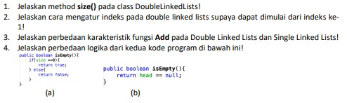

# JOBSHEET XII (Pertemuan 12)
# DOUBLE LINKED LIST

### Dherisma Hanindita Utami
### 2041720018/ 09/ TI 1H

## 12.2
### 12.2.3 Pertanyaan

Jawaban
1. Perbedaan antara single linked list dan double linked list adalah terletak pada pointer nya, dimana pointer pada single linked list hanya next (pointer sesudahnya) dan untuk double linked listed memiliki dua pointer yaitu next (pointer sesudahnya) dan prev (pointer sebelumnya)
2.  Atribut next dan prev memiliki fungsi yang berbeda, dimana atribut next digunakan sebagai pointer untuk node selanjutnya dan atribut prev digunakan sebagai pointer untuk node sebelumnya
3.  Kegunaan dari inisialisasi atribut head dan size seperti kode program tersebut adalah untuk menandakan bahwa head atau node yang terletak diawal masih kosong dan size double linked list masih 0 atau yang berarti bahwa double linked listed masih belum terisi oleh data
4. Pada method addFirst() di pembuatan object dari konstruktor class Node, prev dianggap sama dengan null atau kosong karena digunakan untuk tempat data yang akan ditambahkan pada sebelum node (item)
5.Statement tersebut berarti bahwa node sebelum head adalah node baru pada method addFisrt()
6. Parameter prev sama dengan current berarti bahwa prev yang menjadi fokus kita saat ini dan sama seperti method addFirst(), maka pada method addLast() parameter next dibuat sama dengan null karena akan digunakan untuk data yang ditambahkan di node sesudah data terakhir

## 12.3
### 12.3.3 Pertanyaan

Jawaban
1. Maksud dari statement tersebut pada method removeFirst() adalah dimana jika linked list ternyata tidak kosong datanya lebih dari satu maka node yang ditunjuk oleh pointer next dari head dan node yang ditunjuk oleh pointer prev dari head (yang sebenarnya null/kosong) akan dikurangi atau dihapus
2. Cara mendeteksi posisi data yang ada pada bagian akhir dari method removeLast() adalah sama dengan node yang ditunjuk oleh pointer next dari head == null / kosong, dimana head di inisialisasi sama dengan null dan size-- kemudian di return
3. karena data atau node yang diproses langsung merujuk pada head tanpa menggunakan node bantuan seperti tmp
4. Kode program tersebut berfungsi untuk melewati satu node
Pertanyaan 12.4.3

## 12.4 Tugas
### 12.4.3 Pertanyaan

1.  Method tersebut digunakan untuk me-return jumlah(size) linked lists yang sudah di update
2. Agar indeks dimulai pada indeks ke-1 hal yang harus dilakukan adalah mengganti posisi head dengan head.next
3. Karena pada single linked list hanya memiliki satu pointer, maka ketika menambahkan data hanya fokus pada pointer next. Jika double linked list maka yang diperhatikan adalah kedua pointernya yaitu next dan previous
          
4. Perbedaan logika dari kedua kode program tersebut adalah :

a. Menentuka terlebih dahulu apakah size dari linked list sama dengan 0, jika memenuhi kondisi tersebut akan mengembalikan true atau yang berarti kondisi tersebut benar, dan jika tidak memenuhi kondisi tersebut yang akan dikembalikan adalah false atau kondisi tersebut tidak terpenuhi

b. Method tersebut akan menjalankan statement mengembalikan nilai head == null, atau head sama dengan kosong

## 12.5 Tugas Praktikum
     
Jawaban
Hasil ada di codingan