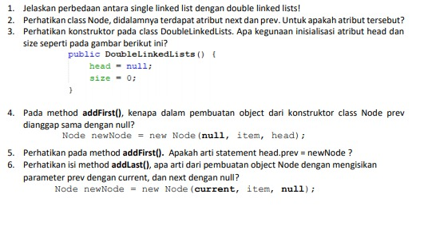
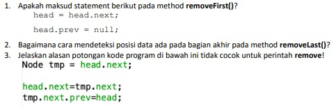

# JOBSHEET IX (Pertemuan 11)
# LINKED LIST

### Dherisma Hanindita Utami
### 2041720018/ 09/ TI 1H

## 9.2
### 9.2.3 Pertanyaan

Jawaban
1. Menghasilkan "Linked Linst Kosong" karena program awal sudah di di set NULL
2. Kegunaan kode =

        ndInput.next = tept.next;
        temp.next = ndInput;
    Kegunaannya yaitu untuk mengenalkan nilai objek baru, dan untuk memberikan pointer pada temp.next dari yang dicari
3.  Kegunaan kode

        if(temp.next.next == null) tai; = tempt.next;
    Kegunaannya adalah untuk menampilkan data nilai baru yang disisipkan bernilai null

## 9.3
### 9.3.3 Pertanyaan

Jawaban
1. Menggunakan keywora break pada fungsi remove yaitu untuk penghentian proses looping saat semua kondisi telah terpenuhi
2. Kegunaan kode dibawah 

        else if(temp.next.data == key){
            temp.next = temp.next.next; 
        }
    Kegunaan nya yaitu untuk menecek apakah data akan sama dengan data yang diinginkan 
3. Kembalian yang pertama adalah -1 jika data yng dicari tidak ada atau tidak ditemukan. Kembalian yang kedua adalah nilai indeks jika data ditemukan

## 9.4 Tugas
## Pertanyaan

1.  