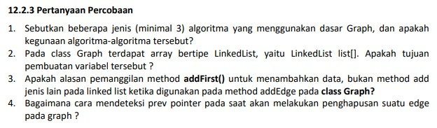
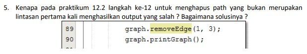
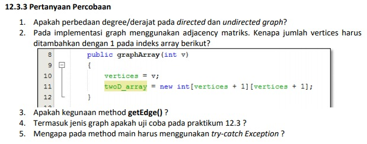
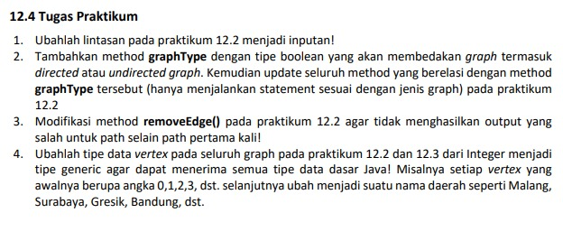

# JOBSHEET XV (Pertemuan 14)
# GRAPH

### Dherisma Hanindita Utami
### 2041720018/ 09/ TI 1H

## 12.2.3 Pertanyaan
 
 

Jawaban
1. Jenis alhgoritma yang menggunakan dasar Graph yaitu :

    a. Algorit,a Djikstra yaitu untuk mencari lintasan terpendek
    b. Algoritma floyd warshall untuk menghitung jarak terpendek untuk semua pasangan titik pada sebuhah graph
    c. Algoritma kruska; yaitu salah satu algoritma dalam teori graph untuk menyelesaikan persoalan pohon merentang minimum

2. Tujuan pembuatan variabel pada class graph yaitu untuk menyimpan data pada graph
3. Alasan pemanggilan method addFirst() yaitu untuk memasukkan data kedalam sebuah antrian
4. melakukan pemanggilan method removeEdge() di class graph setelah itu melakukan looping dan kondisi dimana jika memenuhi kondisi maka didalam method tersebut ada beberapa kondisi maka hasilnya tidak ada data prev yang ada
5. Menyelesaikannya dengan mengganti nilai pada graph.removeEdge(1,3);

## 12.3.3 Pertanyaan

Jawaban
1. Perbedaan degre pada dorected dan uncdirected graph yaitu:

    a. Jika undirected yaitu untuk mengurutkan simpul dalam sebuah busur dan tidak dipentingkan 
    b. Dan apabila jika directerf untuk urutan simpul mempunyai arti
2. Jumalah vertices harus ditambah dengan 1 pada indexs array yaitu : mendeklarasikan twoD_araay dengan kedua size nya vertex +1
3. Kegunaan method getEdge() yaitu :untuk menampikan suatu lintasan pada vertex
4. Jenis graph pada uji coba praktikum 12.3 yaitu jenis graph berarah tetapi tidak berbobot
5. Method main harus menggunakan tr-cath Exception karena untuk mengurangi eksekusi yang menampilkan eror dan membuat program tetap berjalan tanpa dihentikan secara laangsung

## 12.4 PRAKTIKUM

1. 
