# JOBSHEET IV (Pertemuan 05)
# (BRUTE FORCE DAN DIVIDE CONQUE)
#### Dherisma Hanindita Utami
2041720018/09
TI 1H

## 4.2
### 4.2.3 Pertanyaan
* 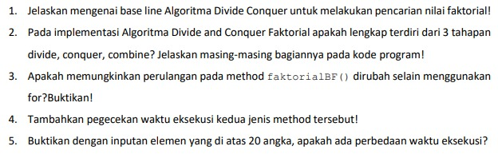

Jawaban 
1. Base line pada faktorial dengan metode divide conquer tersebut adalah apabila nilai n = 1 maka akan mereturn nilai 1 selain itu maka akan memanggill dirinya sendiri atau mereturn n x faktorial(n-1) 
2. 3 tahapan yang ditunjukkan pada kode program Implementasi algoritma divide and conquer faktorial

a. int fakto = n * faktorialDC(n-1);

b. Conquer : int fakto = n * faktorialDC(n-1);

c. Combine : return fakto;
3.  Yaitu :
* 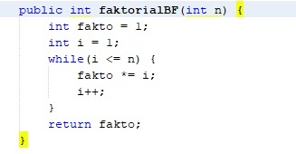

## 4.3
### 4.3.3 Pertanyaan
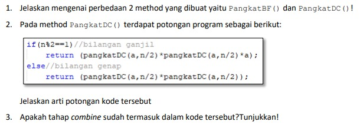
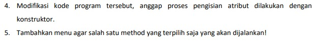

Jawaban
1. Perbedaan 2 method yang dibuat yaitu PangkatBF() dan PangkatDC() adalah :
*  Method pangkatBF() lebih sederhana dibandingkan dengan method pangkatDC(), karena algoritma brute force merupakan algoritma yang sederhana
* Sedangkan PangkatDC() merupakan method yang digunakan untuk mencari hasil dari perpangkatan dari suatu nilai dengan menerapkan algoritma Divide and Conquer atau dalam implementasinya menggunakan method rekursif yang mana method tersebut memanggil dirinya sendiri
2. Yaitu membagi bilangan ganjil dan genap untuk mengeksekusi statement yang ada, dimana if(n%2==1) atau bilangan ganjil maka akan menjalankan statement return (pangkatDC(a, n/2) * pangkatDC(a, n/2) * a);. Dan apabila bilangan genap maka akan menjalankan statement return (pangkatDC(a, n/2) * pangkatDC(a, n/2));
3. Tahapannya sudah termasuk di dalam program
4.  Hasil
* 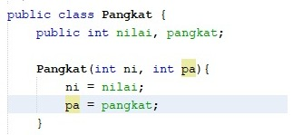
* 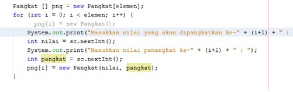
5. * 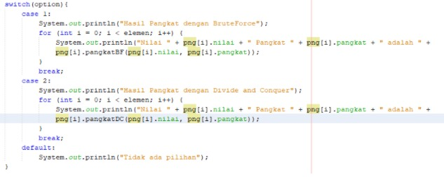

## 4.4
### 4.4.3 Pertanyaan
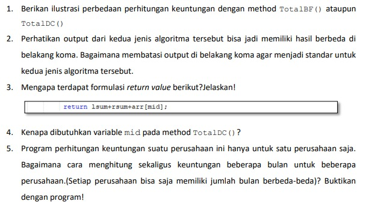

Jawaban
1.  perhitungan keuntungan menggunakan algoritma brute force dan devide conquer adalah : a. Langkah pengerjaan Pada langkah pengerjaan, algoritma brute force manjalankan program secara terurut sedangkan algoritma devide conquer menjalankan program dengan membagi sub masalah kemudia mengeksekusi dan meng-combine nya kembali b. Kode program Kode program algoritma brute force lebih sederhana dibandingkan dengan kode program algoritma devide conquer
2. Menambahkan  %.2f
3. Untuk mengembalikan nilai dari variabel lsum, variabel rsum dan variabel arr[mid] yang mana masing2 dijumlahkan terlebih dahulu, atau dalam Divide and Conquer tahap ini merupakan tahap combine
4. Karena nilai pada variabel mid merupakan nilai tengah yang digunakan pada algoritma devide and conquer

## 4.5 Latihan Praktikum
1. * 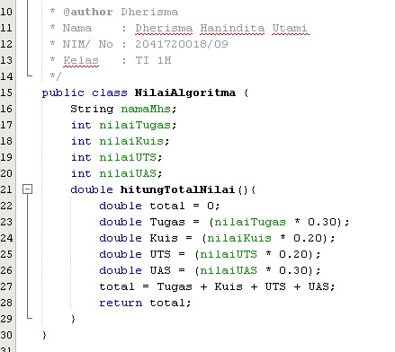
2. 
* 
* 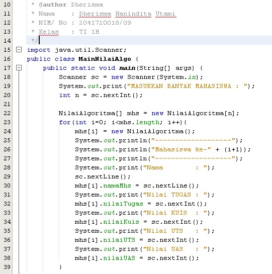
* 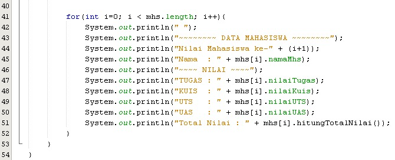
* 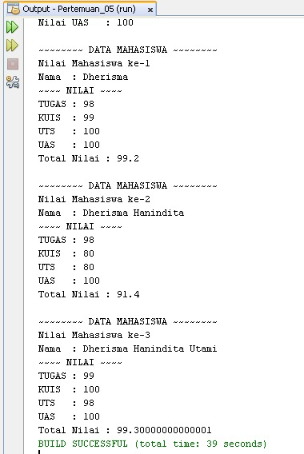
3. 
* 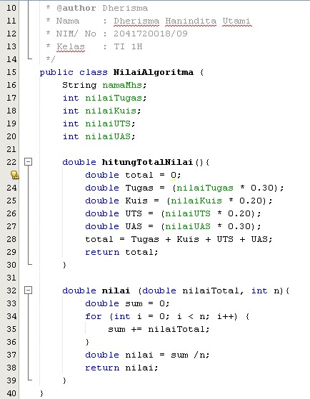
* 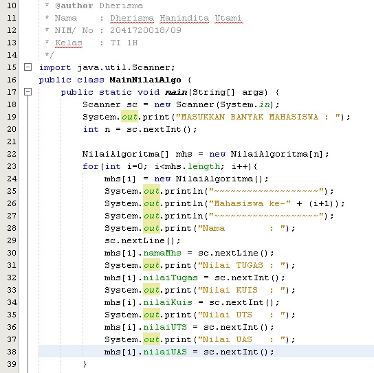
* 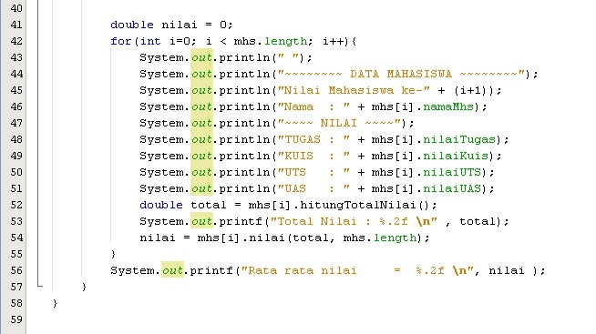
* 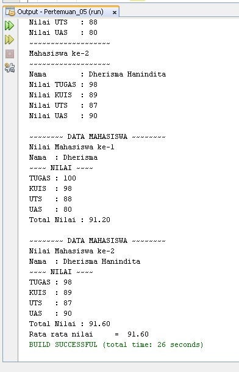
4. 
* 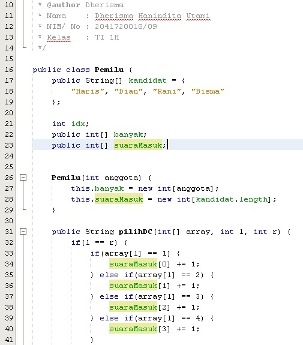
* 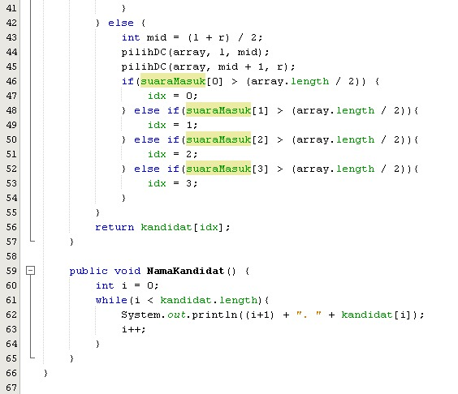
* 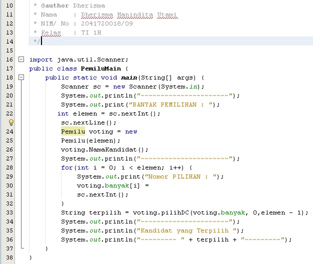
* 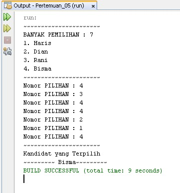