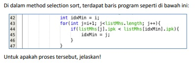

# JOBSHEET V (Pertemuan 6)
### Dherisma Hanindita Utami
### 2041720018/ 09/ TI 1H

## 5.2
### 5.2.3 Pertanyaan

Jawaban
1. Berada pada method void bubbleSort(){}
2. Dalam percobaan diatas tidak terdapat method selectionSort
3. Proses swap adalah menukarkan sebuah proses keluar dari memori untuk sementara waktu ke sebuah penyimpanan sementara dengan sebuah proses lain yang sedang membutuhkan sejumlah alokasi memori untuk dieksekusi, atau sebuah pertukaran suatu variabel dengan variael yang ada pada variabel lainnya

    Potongan untuk sebuah program swap :
    * Mahasiswa temp = listMhs[ j ]; 
    * listMhs[ j ]=listMhs[ j - 1 ];
    * listMhs[ j - 1 ]=temp;
4. Fungsi dari proses diatas terdapat baris program berfungsi untuk pengurutan data dari yang terbesar dan jua melakukan proses swap
5. Perulangan BubbleSort()

    A. Perbedan antara perulangan i dan j adalah :
        
        Jika i berfungsi untuk perulangan yang ada di luar sedangkan pada perulangan j proses yang dijalankan adalah perbandingan seluruh elemen di array
    B. Syarat dari perulangan i adalah i<listMhs.length-1, karena:
        
        untuk melakukan perulangan sebanyak inputan yang dimasukkan pada n
    C. Syarat dari perulangan j adalah j<listMhs.length-i, karena:

        untuk mengulang inputan pada n, dan akan berjalan sampai data pada elemen terakhir terlah terurut
    D. Tahap bubble sort yang ditempuh :

        Mungkin perkiraan yang terjadi sekiatr 50 - 80 kali

## 5.3
### 5.3.3 Pertanyaan

Proses diatas untuk menentukan nilai output dari yang terkecil dari datayang beradai di sebelah kanan

## 5.4
### 5.4.3 Pertanyaan
Ubahlah fungsi pada InsertionSort sehingga fungsi ini dapat melaksanakan proses sorting 
dengan cara ascending atau decending, anda dapat melakukannya dengan menambahkan 
parameter pada pemanggilan fungsi insertionSort
 
