# JOBSHEET VI (Pertemuan 7)
# SEARCHING
### Dherisma Hanindita Utami
### 2041720018/ 09/ TI 1H

## 6.2
### 6.2.3 Pertanyaan
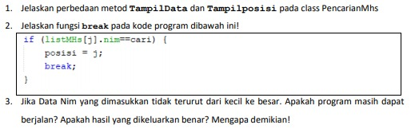

Jawaban
1. Perbedaan metod TampilData(){} dan Tampilposisi(){} :
* TampilData(){} = menampilkan data output yang telah ditemukan
* Tampilposisi(){} = menampilkan posisi data yang ditemukan atau pada indeks
2. Break berfungsi untuk mengehntikan looping jika data sudah ditemukan atau nilainya bernilai TRUE
3. Jika NIM yang dimasukkan tidak urut maka program akan tetap berjalan seperti biasanya dan hasil outputan yang dikeluarkan benar dan jika ingin mencari data nim yang  akan tetap berjalan

## 6.3 
### 6.3.3 Pertanyaan
1. Tunjukkan pada kode program yang mana proses divide dijalankan!
2. Tunjukkan pada kode program yang mana proses conquer dijalankan!
3. Jika data Nim yang dimasukkan tidak urut. Apakah program masih dapat berjalan? Mengapa 
demikian!
4. Jika Nim yang dimasukkan dari NIM terbesar ke terkecil (missal : 20215, 20214, 20212, 20211,
20210) dan elemen yang dicari adalah 20210. Bagaimana hasil dari binary search? Apakah sesuai? 
Jika tidak sesuai maka ubahlah kode program binary seach agar hasilnya sesuai
5. Modifikasilah program diatas yang mana jumlah mahasiswa yang di inputkan sesuai dengan 
masukan dari keyboard

Jawaban:
1. Akan dijalankan pada bagian if(right >= left){}

Yaitu yang berada pada method FindSeqSearch

2. Kode program yang akan dijalankan pada proses conquer  yaitu:
* 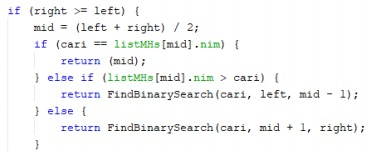
3. Pada percobaan sekarang berbeda dengan percobaan dari yang atas, jika NIM tidak berurutan makan nim itu tidak dapat ditemukan, karena binary search di asumsikan diurutkan terlebih dahulu
4. Nilai NIM akan menjadi tidak beraturan dan tidak dapat ditemukan

Hasil Modif
* 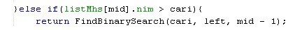
5. Codingan
* 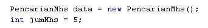

## 6.5 Latihan Praktikum
1. Inputan
* 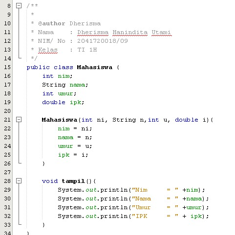
* 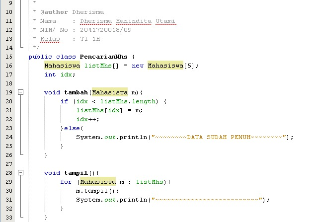
* 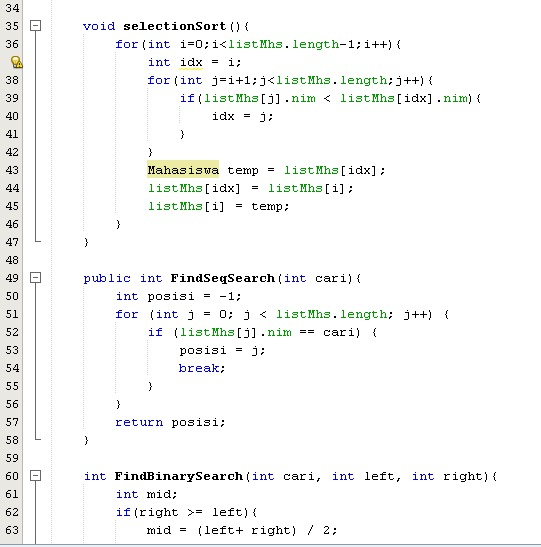
* 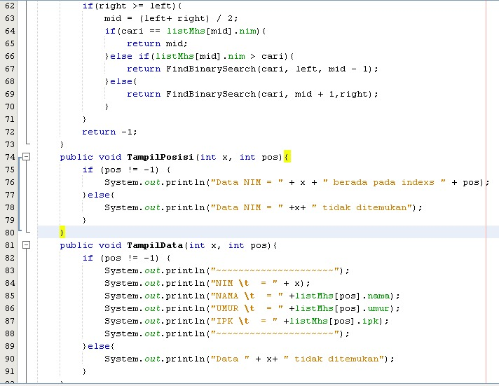
* 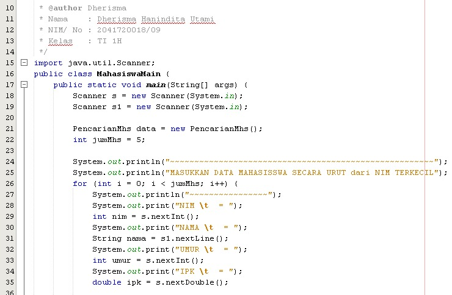
* 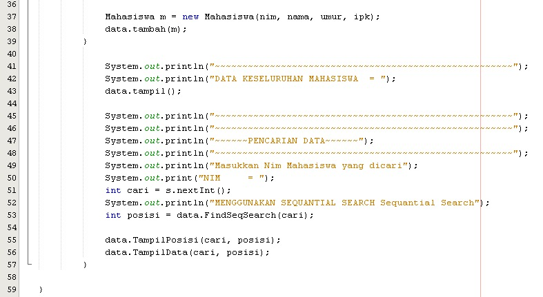 
Hasil
* 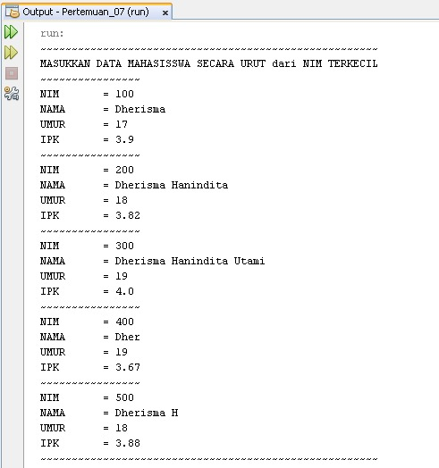
* 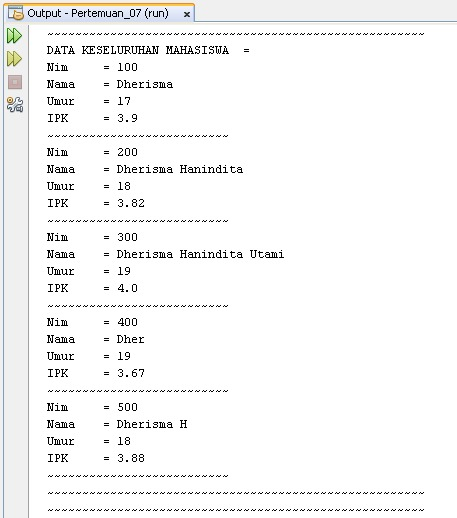
* 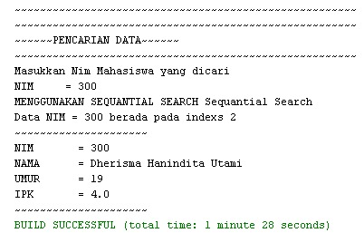
2. 
 * 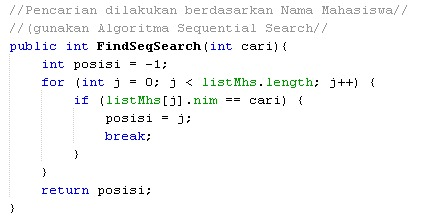
* 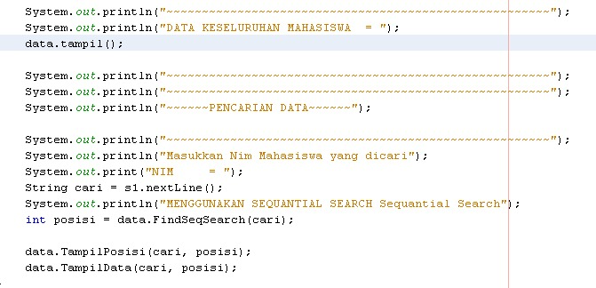
3. Codingan
* 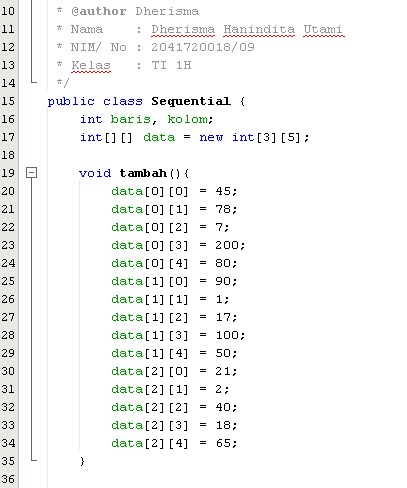
* 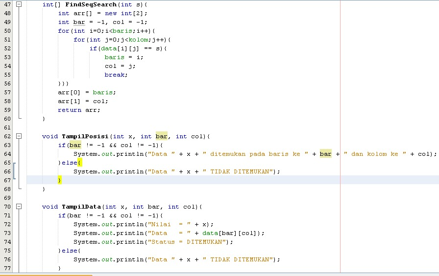
* 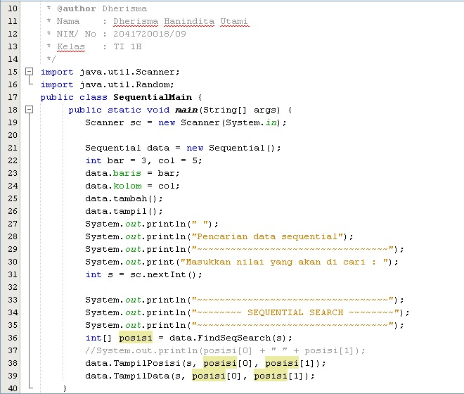
Output
* 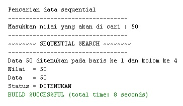
4.
* 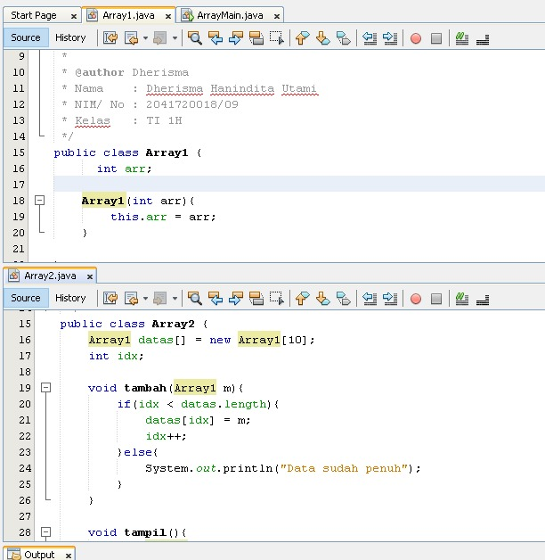
* 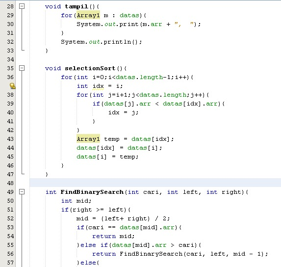
* 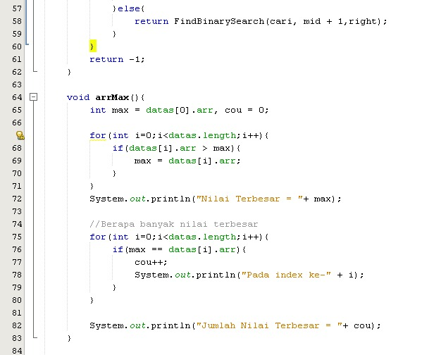
* 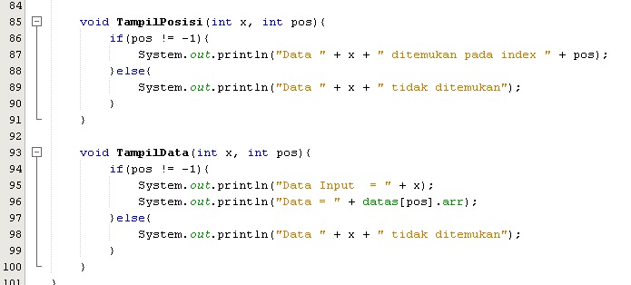
* 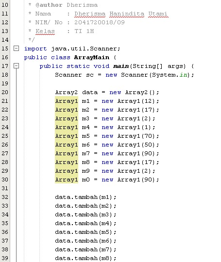
* 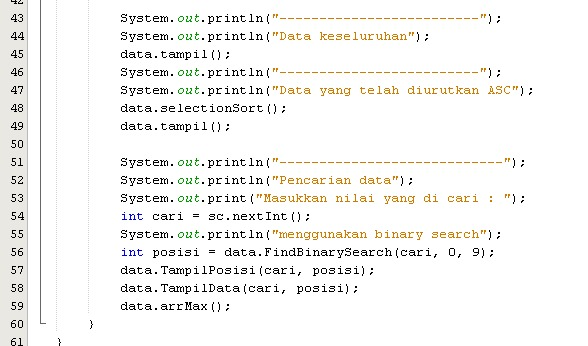
* 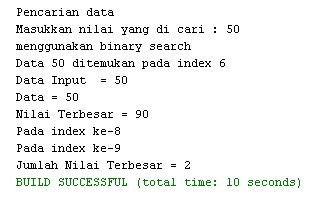
