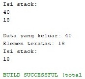
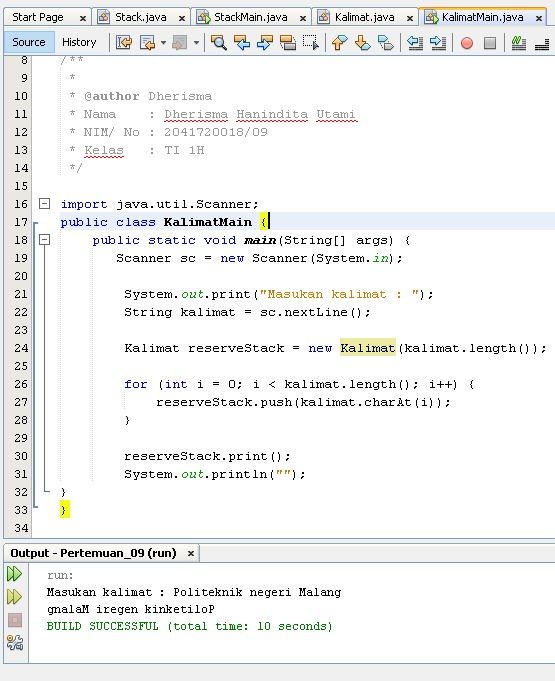
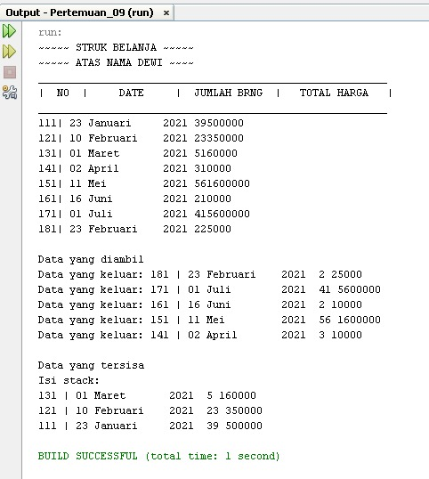

# JOBSHEET VII (Pertemuan 9)
# STACK
### Dherisma Hanindita Utami
### 2041720018/ 09/ TI 1H

## 7.2
### 7.2.3 Pertanyaan

Jawaban
1. Fungsi angka 5 pada potongan kode program diatas adalah untuk menginisialisai size array pada class STACK()
2. Hasil
*      

3. Data yang dimasukkan hanya 18 dan angka 40 tidak dimasukkan karena
data stack sudah memenuhi tempat dan sudah penuh

## 7.3
### 7.3.3 Pertanyaan

Jawaban
1. Data yang tersimpan pada variabel bk adalah judul, nama , tahun, harga dan jumlah
2. Buku st = new Buku(8);
3. Fungsi penggunaan do-while yang berada pada class StackMain adalah untul meloopinh isi data dari buku, jika ingin menambahkan tekan y untuk Ya atau n jika tidak

## 7.4
### 7.4.3 Pertanyaan

Jawaban :
1. Alur kerja pada derajat yaitu :

        int derajat(char c){
            switch(c){
                case '^':
                return 3;
                
                case '%':
                return 2;
                
                case '*':
                return 2;
                
                case '*':
                return 2;
                
                case '-':
                return 1;
                
                case '+':
                return 1;
                default:
                return 0;
            }
        }

2. Fungsi kode 

        c = Q.chartArt(i);

    adalah dimana setiap karakter akan di looping dan dicek di char bagian ke berapa, dan akan memeriksa setiap karakter/huruf
3. * 
4. Tanda kurang tidak ditampilkan pada hasil konversi karena untuk memeriksan dan memastikan semua karakter yang masih berada si stack setelah semua persamaan terbaca, dan akan dipindahkan ke postfix

## 7.5 LATIHAN

Jawaban
1. Codingan
* 
* 
* 

2. Codingan
* 
* 
* 
* 
* 
* 

